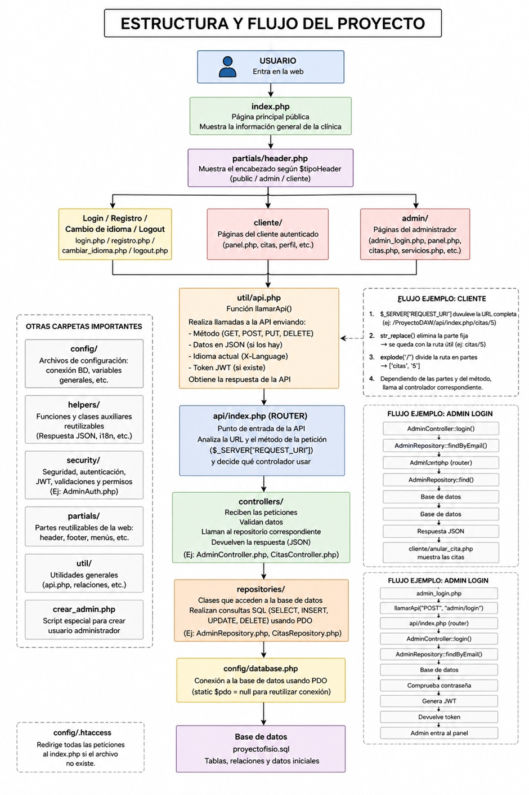
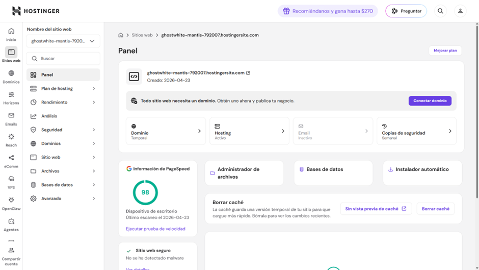
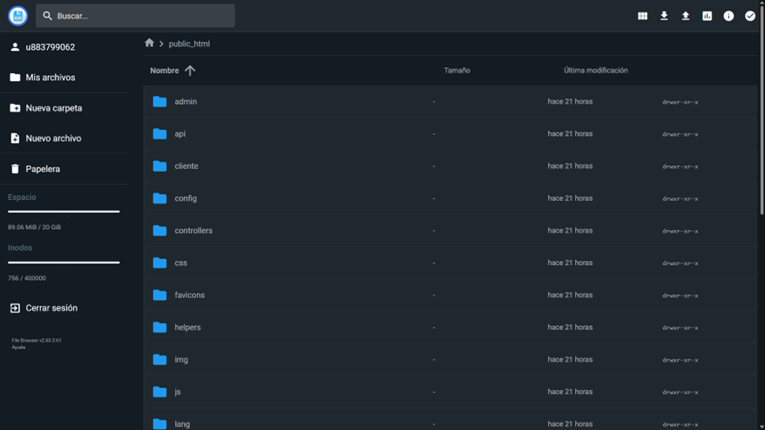
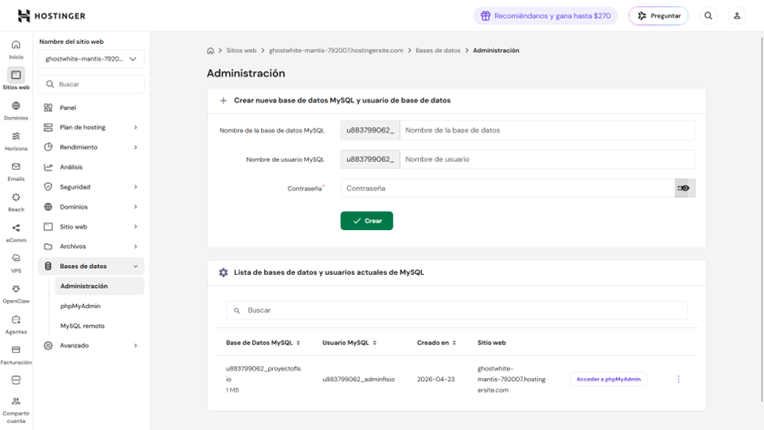

# PROYECTO DESARROLLADO POR

**ROSA MORENO**  
**RUBÉN MORALES**  
**LUIS DE TORO**

---

## ÍNDICE

1. [INTRODUCCIÓN / FINALIDAD](#1-introducción--finalidad)
2. [OBJETIVOS](#2-objetivos)
3. [MEDIOS NECESARIOS](#3-medios-necesarios)
4. [ESTRUCTURA DEL PROYECTO](#4-estructura-del-proyecto)
5. [DIVISIÓN ENTRE FRONTEND Y BACKEND](#5-división-entre-frontend-y-backend)
6. [REGISTRO, LOGIN, GESTIÓN DE USUARIOS (QUÉ PUEDE HACER CADA UNO)](#6-registro-login-gestión-de-usuarios-qué-puede-hacer-cada-uno)
7. [ARQUITECTURA DEL SISTEMA](#7-arquitectura-del-sistema)
8. [BASE DE DATOS](#8-base-de-datos)
9. [API](#9-api)
10. [SEGURIDAD](#10-seguridad)
11. [DISEÑO RESPONSIVE](#11-diseño-responsive)
12. [SISTEMA DE INTERNACIONALIZACIÓN (TRADUCCIONES)](#12-sistema-de-internacionalización-traducciones)
13. [DESPLIEGUE DE LA APLICACIÓN](#13-despliegue-de-la-aplicación)
14. [CONTROL DE VERSIONES (GITHUB)](#14-control-de-versiones-github)
15. [PROBLEMAS ENCONTRADOS](#15-problemas-encontrados)
16. [MODIFICACIONES HECHAS SOBRE EL ANTEPROYECTO INICIAL](#16-modificaciones-hechas-sobre-el-anteproyecto-inicial)
17. [POSIBLES MEJORAS FUTURAS](#17-posibles-mejoras-futuras)
18. [CONCLUSIONES](#18-conclusiones)
19. [BIBLIOGRAFÍA](#19-bibliografía)

---

## 1. INTRODUCCIÓN / FINALIDAD

---

El proyecto consiste en una plataforma web integral diseñada para la gestión de una clínica de fisioterapia.

Su finalidad principal es digitalizar y optimizar el proceso de reserva de citas, permitiendo a los pacientes gestionar sus citas de forma autónoma y al profesional controlar su agenda de manera centralizada. De esta manera, conseguimos una comunicación fluida entre el paciente y el profesional.

La aplicación actúa como una oficina virtual disponible las 24 horas, donde se centraliza la información de los servicios ofrecidos, los horarios de atención y el historial de citas, eliminando la necesidad de gestiones telefónicas manuales para las reservas básicas.

---

## 2. OBJETIVOS

---

El objetivo general del proyecto es crear una plataforma web que permita dar a conocer la clínica, mejorar su organización interna y ofrecer una mejor experiencia al paciente. Para ello, se digitaliza el proceso de gestión de citas reduciendo la carga administrativa.

### Para el usuario público (sin registro)

- **Dar a conocer la clínica:** Mostrar una página principal accesible sin necesidad de registro, donde se presente la clínica, su filosofía y los servicios ofrecidos.

- **Información básica y de contacto:** Facilitar información relevante como horarios, dirección, teléfono y correo electrónico, permitiendo al usuario localizar fácilmente la clínica.

- **Acceso a servicios disponibles:** Mostrar los tratamientos disponibles con una breve descripción para que el usuario pueda conocer las opciones antes de registrarse.

- **Facilidad de acceso:** Incluir herramientas como mapas interactivos y referencias de transporte público cercano, mejorando la accesibilidad física a la clínica.

- **Canales de comunicación:** Ofrecer acceso rápido a medios de contacto como WhatsApp para resolver dudas de forma inmediata.

### Para el Paciente (Cliente)

- **Autogestión de citas:** Permitir al usuario consultar la disponibilidad en tiempo real y reservar sus propias sesiones de forma autónoma a través del panel de cliente.

- **Acceso a información de servicios:** Facilitar una descripción detallada de los tratamientos disponibles (fisioterapia deportiva, punción seca, magnetoterapia, etc.) para que el paciente conozca las opciones antes de acudir.

- **Gestión de perfil personal:** Ofrecer un espacio privado donde el paciente pueda actualizar sus datos de contacto y consultar o anular sus citas programadas.

- **Comunicación directa:** Integrar canales rápidos de contacto, como accesos directos a WhatsApp y localización geográfica mediante mapas interactivos.

### Para el Fisioterapeuta (Administrador)

- **Control de agenda y bloqueos:** Capacidad para definir el horario laboral habitual y establecer "bloqueos de agenda" por motivos puntuales (vacaciones, citas médicas, etc.), evitando solapamientos.

- **Gestión de servicios y tarifas:** Permitir al administrador añadir, modificar o desactivar servicios, ajustando duraciones y precios de forma dinámica en la base de datos.

- **Monitoreo de pacientes:** Centralizar la base de datos de los pacientes registrados, permitiendo un seguimiento organizado de quién reserva cada sesión.

- **Seguridad y autenticación:** Garantizar que solo el personal autorizado pueda modificar la configuración de la clínica mediante un sistema de acceso seguro basado en JWT.

---

## 3. MEDIOS NECESARIOS

---

### HARDWARE:

Ordenadores personales de los miembros del equipo con sistema operativo Windows que actúa como entorno de desarrollo y pruebas. Además, permiten ejecutar tanto el servidor local como las herramientas necesarias para el desarrollo del proyecto.

### SOFTWARE:

- **Lenguajes y tecnologías:** HTML, CSS y JavaScript para el desarrollo del frontend, y PHP para la lógica del backend.

- **Base de datos:** MySQL, utilizado para el almacenamiento de la información de usuarios, citas, servicios y demás datos del sistema.

- **Servidor y despliegue.** Durante el desarrollo se ha utilizado Apache mediante XAMPP como servidor local. Para el despliegue final se ha utilizado Hostinger como servicio de hosting, permitiendo publicar la aplicación en un entorno real accesible desde internet.

- **Control de versiones.** Git y GitHub para la gestión del código, utilizando una estrategia basada en GitFlow para organizar el desarrollo en distintas ramas.

- **Entorno de desarrollo.** Visual Studio Code como editor principal de código, junto con XAMPP para la ejecución del servidor local y la gestión de la base de datos.

- **Herramientas de diseño y documentación.** draw.io y PlantUML para la creación de diagramas, como modelos de base de datos y esquemas del sistema. Google Documents para el desarrollo de la documentación en línea.

- **Otros componentes.** Uso de una API REST propia para la comunicación entre frontend y backend, así como autenticación basada en JWT para la gestión segura de usuarios.

---

## 4. ESTRUCTURA DEL PROYECTO

---

La organización del proyecto sigue una estructura modular que separa la lógica de negocio, la interfaz de usuario y los recursos estáticos para facilitar el mantenimiento, la escalabilidad y el comprender el sistema.

### /admin

Contiene las vistas y la lógica asociada al panel de administración.

- **citas.php, panel.php y servicios.php:** Interfaces de gestión.
- **/js:** Scripts específicos (citas.js, servicios.js) para la lógica dinámica de la administración, como son las validaciones.

### /api

Punto de entrada para las peticiones REST.

- **index.php:** Actúa como enrutador principal (front controller), recibiendo todas las peticiones y redirigiéndolas al controlador correspondiente.
- **.htaccess:** Permite el uso de URLs amigables y redirección de rutas hacia el index principal.

### /cliente

Contiene las vistas destinadas a los pacientes registrados.

- **panel.php:** Panel principal del usuario.
- **perfil.php:** Gestión de datos personales.
- **citas_disponibles.php y anular_cita.php:** Gestión de reservas.
- **/js:** Scripts específicos (citas_disponibles.js, modales.js, perfil.js) para la interacción del usuario, entre ellas validaciones.

### /config

Archivos de configuración técnica.

- **database.php:** Define la conexión PDO con la base de datos.

### /controllers

Capa de controladores que actúa como intermediaria entre la API y la lógica de datos. Incluye controladores como:

- **AdminController.php**
- **AuthController.php**
- **BloqueosController.php**
- **CitasController.php**
- **HorariosController.php**
- **ServiciosController.php**

### /css

Recursos de estilo de la aplicación.

- **normalize.css:** Reseteo de estilos para asegurar consistencia entre navegadores.
- **style.css:** Estilos personalizados de la aplicación.

### /favicons

Iconos y manifiestos de configuración necesarios para la identidad visual en diversos navegadores y dispositivos.

### /helpers

Clases auxiliares de apoyo que abstraen tareas repetitivas.

- **i18n.php:** Gestión de internacionalización.
- **Request.php:** Manejo de peticiones HTTP.
- **Response.php:** Estandarización de respuestas de la API.

### /img

Repositorio de imágenes optimizadas (formato .webp) que ilustran los servicios de la clínica (Punción seca, Magnetoterapia, etc.) y logotipos de la marca.

### /js

Scripts de interactividad general para las páginas públicas.

- **login.js y registro.js:** Validaciones y lógica de los formularios de autenticación.

### /lang

Archivos de traducción.

- **es.php y en.php:** Diccionarios que permiten la traducción dinámica de la interfaz.

### /partials

Componentes reutilizables para mantener la coherencia visual.

- **header.php:** Cabecera común de la aplicación.
- **/js:** header.js Para el comportamiento del menú y navegación.

### /repositories

Capa de acceso a datos. Clases que encapsulan las consultas SQL (utilizando PDO) para cada entidad (Pacientes, Citas, Servicios, Bloqueos, etc.), aislando la base de datos del resto de la aplicación. Incluye archivos como:

- **PacientesRepository.php**
- **CitasRepository.php**
- **ServiciosRepository.php**
- **BloqueosRepository.php**
- **HorariosRepository.php**

### /security

Gestión de seguridad y autenticación.

- **JWT.php:** Generación y validación de tokens JSON Web Token (JWT).
- **Auth.php y AdminAuth.php:** Verificación de sesiones y permisos según el rol del usuario.

### /util

Funciones y utilidades compartidas en toda la aplicación.

- **Html.php:** Generación dinámica de estructuras HTML.
- **api.php:** Funciones auxiliares para realizar llamadas a la API desde el frontend PHP.

Además, en la raíz del proyecto se encuentran los archivos principales como:

- **index.php:** Página de aterrizaje (Landing Page) del proyecto.

- **login.php / registro.php:** Formularios de acceso y creación de cuenta para usuarios.

- **admin_login.php:** Acceso específico para el personal administrativo.

- **crear_admin.php:** Script de utilidad para la generación de cuentas de administrador.

- **logout.php:** Cierre de sesión y destrucción de tokens.

- **cambiar_idioma.php:** Endpoint para gestionar la preferencia de lenguaje en la sesión.

- **proyectofisio.sql:** Script de exportación de la base de datos que incluye la estructura de tablas y datos iniciales.





---

## 5. DIVISIÓN ENTRE FRONTEND Y BACKEND

---

El proyecto se divide en dos partes principales: el frontend, encargado de la interfaz de usuario, y el backend, responsable de la lógica de negocio, la seguridad y la gestión de datos.

### Frontend (Interfaz de Usuario)

Corresponde a todos los elementos visibles con los que interactúa el usuario (paciente o administrador) desde el navegador.

- **Vistas PHP (raíz, /cliente, /admin).** Actúan como plantillas que generan el HTML que se muestra en pantalla. Incluyen tanto la parte pública (index.php, login.php, registro.php), como las vistas del cliente (cliente/panel.php, cliente/perfil.php) y del administrador (admin/panel.php, admin/citas.php, admin/servicios.php).

- **Lógica de cliente (/js, /cliente/js, /admin/js, /partials/js).** Scripts en JavaScript encargados de la interactividad y comportamiento dinámico de la aplicación.

  Ejemplos:

  - citas_disponibles.js para la gestión dinámica de reservas.
  - servicios.js para la administración en tiempo real.
  - modales.js para la interacción con ventanas emergentes.
  - header.js para el menú responsive entre otros.

- **Hojas de estilo (/css).** Contiene los estilos visuales de la aplicación.

  - style.css: Diseño personalizado y responsive.
  - normalize.css: Normalización de estilos entre navegadores.

- **Recursos visuales (/img, /favicons).** Archivos gráficos (formato .webp) e iconos utilizados en la interfaz, incluyendo imágenes de servicios y elementos de identidad visual.

- **Internacionalización (/lang).** Archivos es.php y en.php que contienen los textos traducidos, permitiendo cambiar el idioma dinámicamente en la interfaz. Funcionan como diccionarios.

### Backend (Lógica de Servidor y Datos)

Corresponde a todos los componentes que se ejecutan en el servidor y gestionan la lógica interna del sistema.

- **Punto de entrada y enrutamiento (/api).** El archivo api/index.php centraliza todas las peticiones y actúa como front controller, redirigiéndolas al controlador correspondiente según la ruta solicitada.

- **Controladores (/controllers).** Procesan las peticiones recibidas desde la API y aplican la lógica de negocio.

  Ejemplos:

  - CitasController.php: gestión de reservas.
  - BloqueosController.php: control de disponibilidad.
  - ServiciosController.php: gestión de servicios.

- **Capa de datos (/repositories).** Clases encargadas de ejecutar consultas SQL utilizando PDO, encapsulando el acceso a la base de datos.

  Ejemplos:

  - PacientesRepository.php
  - CitasRepository.php
  - ServiciosRepository.php

- **Seguridad y autenticación (/security).** Implementación de autenticación basada en JWT (JSON Web Token), junto con control de acceso por roles mediante Auth.php y AdminAuth.php.

- **Infraestructura y soporte (/config, /helpers, /util).** Incluye archivos auxiliares necesarios para el funcionamiento del sistema:

  - database.php: configuración de la conexión a la base de datos.
  - Request.php y Response.php: gestión estandarizada de peticiones y respuestas HTTP.
  - Html.php: generación dinámica de elementos HTML.
  - api.php: funciones auxiliares para comunicación interna con la API.

- **Persistencia de datos.** El archivo proyectofisio.sql define la estructura de la base de datos, incluyendo tablas de usuarios, citas, servicios, horarios y bloqueos.

---

## 6. REGISTRO, LOGIN, GESTIÓN DE USUARIOS (QUÉ PUEDE HACER CADA UNO)

---

| Funcionalidad | Admin / Fisioterapeuta | Cliente / Paciente |
|---|---:|---:|
| Registro | ❌ | ✅ |
| Iniciar sesión | ✅ | ✅ |
| Modificar datos personales | ❌ | ✅ |
| Configurar horarios de apertura | ✅ | ❌ |
| Ver servicios disponibles | ✅ | ✅ |
| Reservar citas | ❌ | ✅ |
| Cancelar citas | ✅ | ✅ |
| Ver historial de citas | ✅ | ✅ |
| Gestión de servicios | ✅ | ❌ |
| Configurar bloqueos | ✅ | ❌ |

---

## 7. ARQUITECTURA DEL SISTEMA

---

El proyecto sigue una arquitectura basada en una separación clara de responsabilidades, inspirada en el patrón MVC (Modelo-Vista-Controlador) y combinada con una API REST.

El patrón MVC permite dividir la aplicación en tres partes principales:

### Vista (Frontend)

Se encarga de mostrar la información al usuario y gestionar la interacción en el navegador. Está formada por las vistas PHP, hojas de estilo (CSS) y scripts JavaScript.

### Controlador (Controllers)

Gestiona las peticiones que llegan desde la API, aplica la lógica de negocio y coordina la comunicación entre la vista y los datos.

### Modelo (Repositories)

Se encarga del acceso a datos y de la comunicación con la base de datos mediante consultas SQL encapsuladas, utilizando PDO para garantizar seguridad y modularidad.

Además, el sistema utiliza una API REST, donde todas las peticiones se gestionan a través del archivo /api/index.php, que actúa como punto de entrada único (front controller).

Este archivo recibe las solicitudes del cliente, analiza la ruta solicitada y redirige la petición al controlador correspondiente, que se encarga de procesarla y devolver una respuesta en formato JSON.

Gracias a esta arquitectura, se consigue:

- Separar completamente el frontend del backend.
- Facilitar el mantenimiento del código.
- Permitir futuras ampliaciones del sistema.
- Mejorar la organización y escalabilidad del proyecto.

---

## 8. BASE DE DATOS

---

El sistema no solo se basa en las entidades principales (Paciente, Cita y Servicio), sino que incluye otras tablas necesarias para garantizar el correcto funcionamiento de la aplicación en un entorno real.

La base de datos está diseñada siguiendo un modelo relacional, donde cada entidad se representa mediante una tabla y las relaciones entre ellas permiten mantener la coherencia de la información.

### Tablas principales:

- **Pacientes.** Almacena los datos de los usuarios registrados en la plataforma, como nombre, correo electrónico, contraseña cifrada y otros datos necesarios para la gestión de su cuenta.

- **Citas.** Representa las reservas realizadas por los pacientes. Cada cita está asociada a un paciente, a un servicio y a una fecha y hora concreta.

- **Servicios.** Contiene los tratamientos disponibles en la clínica, incluyendo información como nombre, descripción, duración y precio.

### Tablas adicionales:

- **Horarios.** Define los tramos horarios disponibles para la reserva de citas, según el horario laboral establecido por el profesional.

- **Bloqueos.** Permite bloquear fechas o periodos concretos (vacaciones, días festivos, incidencias, etc.), evitando que se puedan coger reservas en esos intervalos.

- **Admins.** Almacena los usuarios con permisos de administración. Está destinada exclusivamente al personal de la clínica que gestiona el sistema.

### Relaciones entre tablas:

- Un paciente puede tener varias citas (relación 1:N entre Pacientes y Citas).

- Un servicio puede estar asociado a múltiples citas (relación 1:N entre Servicios y Citas).

- Cada cita pertenece a un único paciente y a un único servicio (relaciones N:1).

- Los horarios y los bloqueos no se relacionan directamente mediante claves foráneas, pero afectan a la lógica de disponibilidad de las citas, siendo utilizados por el sistema para validar si una reserva es posible o no.

### Reglas de integridad:

- No se pueden crear citas en fechas bloqueadas.
- No se pueden crear citas fuera del horario definido.
- No se permiten solapamientos de citas en el mismo tramo horario.
- Las contraseñas se almacenan de forma cifrada para mejorar la seguridad.

Este diseño permite gestionar correctamente la agenda del profesional, evitar reservas inválidas y mantener un sistema consistente y fiable.

---

## 9. API

---

Nuestra aplicación web utiliza una API REST para gestionar todas las operaciones entre el frontend y el backend.

El archivo /api/index.php actúa como punto de entrada único (front controller), recibiendo todas las peticiones HTTP y redirigiéndolas al controlador correspondiente en función de la ruta y el método utilizado.

### Flujo de funcionamiento:

1. El usuario realiza una acción desde la interfaz (por ejemplo, consultar citas disponibles o reservar una cita).

2. El frontend envía una petición HTTP a la API (GET, POST, PUT o DELETE).

3. La API recibe la petición a través de /api/index.php.

4. Se analiza la ruta solicitada y se delega la petición al controlador correspondiente.

5. El controlador procesa la lógica de negocio y, si es necesario, interactúa con la base de datos a través de los repositories.

6. Se genera una respuesta en formato JSON mediante las clases de apoyo (Response.php).

7. El frontend recibe la respuesta y actualiza la interfaz de usuario dinámicamente.

### Tipos de peticiones utilizadas:

- **GET** → Para obtener información (por ejemplo, listar servicios o citas disponibles).

- **POST** → Para crear nuevos recursos (reservar una cita, registrar un usuario).

- **PUT** → Para actualizar información (modificar perfil, cambiar estado de una cita).

- **DELETE** → Para eliminar recursos (horarios, bloqueos).

### Formato de comunicación:

Todas las respuestas de la API se devuelven en formato JSON, lo que facilita la comunicación entre cliente y servidor y permite una integración sencilla con cualquier frontend.

### Seguridad:

El sistema utiliza autenticación basada en JSON Web Token (JWT), lo que permite validar la identidad del usuario en cada petición sin necesidad de mantener sesiones en el servidor.

Esto garantiza que solo los usuarios autenticados puedan acceder a recursos protegidos, como el panel de cliente o la administración.

Este enfoque permite desacoplar completamente la lógica del servidor de la interfaz, facilitando el mantenimiento, la escalabilidad y futuras ampliaciones del sistema.

---

## 10. SEGURIDAD

---

Se ha implementado un mecanismo de autenticación basado en JWT (JSON Web Token).

JWT es un estándar que permite generar tokens seguros que contienen información del usuario y sus permisos, evitando la necesidad de mantener sesiones tradicionales en el servidor. Esto permite una autenticación sin estado (stateless), más eficiente y escalable.

Este enfoque permite proteger los datos de los usuarios y garantizar que solo las personas autorizadas puedan acceder a las funcionalidades del sistema.

### Funcionamiento:

1. El usuario introduce sus credenciales en el formulario de login.

2. El servidor valida los datos y genera un token firmado (JWT), que incluye información del usuario y una fecha de expiración.

3. El servidor envía el token al cliente y este se almacena en una cookie llamada "jwt", configurada con medidas de seguridad como HttpOnly y SameSite.

4. En cada petición posterior, la cookie se envía automáticamente al servidor.

5. El servidor verifica la validez del token (firma y expiración) antes de permitir el acceso a los recursos protegidos.

### Medidas de seguridad implementadas:

- **Contraseñas cifradas:** Las contraseñas no se almacenan en texto plano, sino mediante funciones de hash seguras, evitando que puedan ser recuperadas en caso de acceso indebido a la base de datos.

- **Autenticación mediante JWT:** Se utiliza un sistema de tokens firmados que permite validar la identidad del usuario en cada petición sin necesidad de mantener sesiones en el servidor.

- **Uso de cookies seguras:** El token se almacena en una cookie con atributos HttpOnly, SameSite y Secure (cuando es posible), lo que ayuda a proteger frente a muchos ataques.

- **Control de acceso por roles:** El sistema diferencia entre usuarios cliente y administrador, restringiendo el acceso a determinadas rutas según el tipo de usuario.

- **Protección de rutas:** Las rutas sensibles (panel de cliente, administración, gestión de citas, etc.) requieren un token válido para poder ser accedidas.

### Mejoras de seguridad a futuro:

El sistema ofrece un nivel de seguridad pero, en un entorno real se podrían aplicar mejoras adicionales como:

- Uso obligatorio de HTTPS.
- Implementación de refresh tokens.
- Limitación de intentos de inicio de sesión (protección contra fuerza bruta).
- Mayor control de validación de datos de entrada.

---

## 11. DISEÑO RESPONSIVE

---

La aplicación se ha diseñado para adaptarse a distintos dispositivos, como móviles, tablets y ordenadores.

Para ello, se han utilizado media queries en CSS, que permiten cambiar el diseño en función del tamaño de la pantalla.

### Características principales:

- **Menú de navegación adaptable:** En dispositivos móviles se muestra un menú tipo hamburguesa, mientras que en pantallas grandes se presenta el menú completo.

- **Adaptación de formularios:** Los formularios se reorganizan en pantallas pequeñas para que sean más fáciles de usar, pasando a una sola columna.

- **Tablas con scroll horizontal:** En móviles, las tablas permiten hacer scroll horizontal para no romper el diseño.

- **Distribución flexible de elementos:** Se utilizan Flexbox y Grid para organizar los elementos y adaptarlos al espacio disponible.

- **Cambios según el tamaño de pantalla:** El diseño cambia automáticamente según el ancho del dispositivo (por ejemplo, el menú o la distribución de elementos), mejorando la experiencia del usuario.

### Tecnologías utilizadas:

- CSS3 con media queries.
- Flexbox.
- CSS Grid.

---

## 12. SISTEMA DE INTERNACIONALIZACIÓN (TRADUCCIONES)

---

La aplicación incluye soporte para múltiples idiomas mediante un sistema de internacionalización (i18n), permitiendo cambiar el idioma de forma dinámica. Actualmente, se encuentran implementados dos idiomas: español e inglés.

### Funcionamiento

El sistema se basa en archivos de traducción ubicados en la carpeta /lang, donde cada idioma tiene su propio fichero:

- es.php → Español
- en.php → Inglés

En estos archivos se definen claves asociadas a textos, por ejemplo:

```php
"login_title" => "Iniciar sesión"
```

### Uso en la aplicación

En las vistas PHP, en lugar de escribir directamente el texto, se utiliza una función de traducción:

```php
t("login_title")
```

Esta función devuelve el texto correspondiente según el idioma activo, lo que permite reutilizar las mismas vistas para todos los idiomas.

### Cambio de idioma

El idioma se puede cambiar mediante un selector en la interfaz.

Cuando el usuario selecciona un idioma:

1. Se envía una petición a cambiar_idioma.php.
2. Se guarda la preferencia en la sesión.
3. La aplicación carga automáticamente el archivo de idioma correspondiente.

### Ventajas

- Permite adaptar la aplicación a distintos usuarios
- Facilita la ampliación a nuevos idiomas
- Mantiene el código organizado y limpio
- Evita duplicar vistas para cada idioma

### Decisión de diseño

Se ha optado por este sistema de traducción manual en lugar de utilizar herramientas automáticas, ya que la aplicación maneja vocabulario técnico propio del ámbito de la fisioterapia.

De esta manera, se tiene un control total sobre los textos mostrados, asegurando que las traducciones sean correctas y coherentes en todo momento, evitando posibles errores de interpretación.

### Limitaciones y mantenimiento

Este enfoque también implica que la aplicación requiere mantenimiento en cuanto a los idiomas.

Por ejemplo:

- Los servicios son gestionados por el administrador y se introducen únicamente en español, ya que la web está orientada a una clínica real en Córdoba.
- Si se desea ofrecer estos contenidos en otros idiomas, será necesario añadir manualmente las traducciones correspondientes.
- Cada nuevo texto que se añada al sistema debe incluir su traducción en todos los archivos de idioma.

A pesar de esta limitación, se considera una solución adecuada para el contexto, ya que prioriza la precisión del contenido frente a la automatización.

---

## 13. DESPLIEGUE DE LA APLICACIÓN

---

El proyecto ha sido desarrollado y probado inicialmente en un entorno local, y posteriormente desplegado en un servidor de producción (Hostinger).

### Entorno local

Durante el desarrollo se ha utilizado un entorno local basado en XAMPP, que incluye:

- Servidor Apache para ejecutar la aplicación.
- MySQL para la base de datos.
- PHP como lenguaje de servidor.

De esta manera, se ha podido desarrollar, probar y depurar la aplicación de forma rápida antes de su despliegue final.

El acceso se realizaba mediante rutas locales (localhost), facilitando la integración entre frontend y backend.

### Entorno de producción

Una vez finalizado el desarrollo, la aplicación se ha desplegado en un servidor de hosting, en este caso Hostinger.

El despliegue se ha realizado directamente desde el panel de control del hosting, subiendo los archivos del proyecto al directorio público del servidor.

Hostinger, además de la manera en que hemos subido nuestra aplicación, da la posibilidad de poder desplegar la aplicación a través de un repositorio de GitHub o también, a través de FTP.

Los pasos principales que se han seguido han sido:

1. Subida de los archivos del proyecto mediante el administrador de archivos de Hostinger en el directorio public_html, que es lo que va a mostrar en la web públicamente.
2. Creación y configuración de la base de datos en el hosting.
3. Importación del fichero proyectofisio.sql.
4. Configuración de la conexión a base de datos en el archivo database.php.
5. Corrección de las rutas de todos los archivos, ya que ahora no se encuentra en localhost.

Además, se ha realizado:

- Uso de HTTPS para mejorar la seguridad, ya que el hosting daba la posibilidad.
- Pruebas en entorno real tras el despliegue.
- Verificación del correcto funcionamiento en distintos dispositivos.

### Acceso al panel de Hostinger:

Se puede acceder al panel mediante la siguiente URL, introduciendo las credenciales oportunas:

https://hpanel.hostinger.com/websites/ghostwhite-mantis-792007.hostingersite.com

Desde este panel se pueden gestionar los archivos, bases de datos y configuración general del hosting.

### Acceso a la aplicación:

La aplicación está disponible a través de una URL pública:

https://ghostwhite-mantis-792007.hostingersite.com/

Desde esta dirección se puede acceder tanto a la parte pública de la clínica como a las áreas privadas de usuario y administración (previa autenticación).

Esto permite que el sistema funcione en un entorno real de producción, pudiendo ser utilizado desde cualquier dispositivo con conexión a Internet.







---

## 14. CONTROL DE VERSIONES (GITHUB)

---

Para mantener la estabilidad del proyecto y un historial de cambios limpio, se ha seguido una metodología basada en GitFlow, intentando seguir el estilo de trabajo real. A continuación se detalla el proceso de integración de código utilizado durante el desarrollo.

### Estructura de ramas

Se han utilizado las siguientes ramas principales:

- **main:** contiene la versión final y estable del proyecto. No se trabaja directamente sobre esta rama.
- **develop:** rama principal de desarrollo donde se integran las funcionalidades terminadas.
- **feature/\*:** se crea una rama por cada tarea o funcionalidad, partiendo siempre de develop.
- **release/\*:** se utiliza para preparar una versión final antes de pasar a producción.

### Flujo de trabajo

#### 1. Actualizar la rama develop

Antes de comenzar cualquier tarea, se actualiza la rama de desarrollo:

```bash
git checkout develop
git pull origin develop
```

#### 2. Crear una nueva feature

Cada nueva funcionalidad se desarrolla en su propia rama:

```bash
git checkout -b feature/nombre-tarea
```

#### 3. Desarrollo y subida de cambios

Durante el desarrollo, se van guardando los cambios de forma progresiva:

```bash
git add .
git commit -m "Mensaje claro"
git push -u origin feature/nombre-tarea
```

Si la rama ya estaba subida previamente, basta con:

```bash
git push
```

#### 4. Actualizar la feature antes de integrar

Antes de crear el Pull Request, la rama se sincroniza con develop:

```bash
git checkout develop
git pull origin develop
git checkout feature/nombre-tarea
git pull origin feature/nombre-tarea
git merge develop
git push
```

Esto permite incorporar los últimos cambios y evitar conflictos en el merge final.
En caso de conflictos, estos deben resolverse antes de continuar.

#### 5. Creación del Pull Request

Cuando la funcionalidad está terminada:

1. Acceder al repositorio en GitHub.
2. Ir a la pestaña Pull requests.
3. Pulsar en New pull request.
4. Seleccionar:
   - base: develop
   - compare: feature/nombre-tarea
5. Pulsar en Create pull request.
6. Revisar la pestaña Files changed.
7. Si todo es correcto, pulsar en Merge pull request.
8. Confirmar el merge.
9. Eliminar la rama si ya no se va a seguir utilizando.

#### 6. Actualizar develop en local.

Una vez integrada la funcionalidad:

```bash
git checkout develop
git pull origin develop
```

#### 7. Creación de una release

Cuando la rama develop se considera estable, se prepara una versión:

```bash
git checkout develop
git pull origin develop
git checkout -b release/v1.0
git push -u origin release/v1.0
```

#### 8. Integración de la release

La rama release se fusiona en:

- main (versión final)
- develop (para mantener coherencia)

Primero se realiza un Pull Request de release/v1.0 a main, y posteriormente otro de release/v1.0 a develop.

Durante el desarrollo se han seguido las siguientes normas:

- No trabajar directamente en main.
- No trabajar directamente en develop.
- Toda tarea nueva se ha realizado en una rama feature/*.
- Avisar si varias personas van a modificar el mismo archivo.
- Revisar siempre base y compare antes de hacer un merge.
- Revisar siempre la pestaña Files changed antes de confirmar un Pull Request.
- Eliminar las ramas que ya han sido fusionadas y no se van a seguir utilizando.

De esta manera hemos conseguido mantener un control claro de los cambios, evitar conflictos innecesarios y facilitar el trabajo organizado durante todo el desarrollo del proyecto.

La URL del repositorio público es: https://github.com/rosaml1996/ProyectoDAW.git

---

## 15. PROBLEMAS ENCONTRADOS

---

Durante el desarrollo del proyecto han surgido distintos problemas técnicos, tanto en la fase de desarrollo en local como en el despliegue en producción. A continuación, se describen los más importantes:

### Problemas con la conexión a la base de datos y configuración en producción

Se detectaron errores relacionados con la conexión a la base de datos, especialmente en el archivo config/database.php.

Uno de los principales problemas estaba en el parámetro dbname del $dsn, que debe coincidir exactamente con el nombre de la base de datos creada en phpMyAdmin.

Se identificaron dos variantes de este error:

1. Que el nombre de la base de datos en phpMyAdmin no coincidiera con el dbname definido en el $dsn.
2. Que el dbname se configurara incorrectamente utilizando el nombre del archivo .sql en lugar del nombre real de la base de datos importada.

Esto provocaba que la aplicación no pudiera conectarse a la base de datos, generando fallos en todas las funcionalidades dependientes de ella.

### Problemas en Hostinger con la autenticación y la API

Una vez desplegada la aplicación en Hostinger, al intentar iniciar sesión (tanto como paciente como administrador), aparecían errores como:

- “Respuesta no válida de la API”
- “No se pudo iniciar sesión como administrador”

Para solucionarlo, fue necesario modificar:

- La variable $url en el archivo /util/api.php
- Los parámetros de conexión ($dsn, $usuario y $password) en /config/database.php

Causa del problema:

El origen del fallo estaba en que la aplicación seguía utilizando configuraciones propias del entorno local:

- **PDO Connection:** el sistema intentaba conectarse a una base de datos en localhost, que no existe en el servidor de Hostinger.
- **API Endpoint:** el servidor realizaba peticiones a sí mismo utilizando localhost, lo que provocaba errores de conexión o respuestas vacías.

Esto daba lugar al mensaje “Respuesta no válida de la API”, ya que no se recibía una respuesta correcta desde el backend.

### Solución aplicada

Se adaptaron todas las configuraciones al entorno de producción:

- Se actualizó la variable $url para que apuntara al dominio real del servidor.
- Se configuraron correctamente los datos de conexión a la base de datos remota.
- Se revisaron las rutas para evitar referencias a localhost.

Tras estos cambios, la aplicación comenzó a funcionar correctamente en producción.

### Problemas de caché del navegador (uso de ?v=2)

Una vez en producción, durante el desarrollo frontend, especialmente en CSS y JavaScript, se vio que el navegador almacenaba versiones antiguas de los archivos.

Esto provocaba que cambios realizados en el código no se reflejaran en la web, generando confusión durante las pruebas.

Para solucionarlo, se utilizó una técnica de versionado en las rutas de los archivos, añadiendo parámetros como:

```text
style.css?v=2
script.js?v=2
```

De esta forma, se fuerza al navegador a cargar la versión más reciente del archivo, evitando problemas de caché.

Luego, para no depender de estar cambiando el código subiendo la versión cada vez que se hiciera un cambio, se ha cambiado de metodología a limpiar la caché del propio hosting, de esta manera queda solucionado el problema también.

### Problemas de sincronización entre frontend y backend

En algunas funcionalidades (como la reserva de citas), se produjeron inconsistencias entre lo que mostraba el frontend y lo que realmente estaba disponible en la base de datos.

Esto obligó a revisar:

- La lógica de actualización de citas disponibles.
- El control de bloqueos y horarios.
- La sincronización tras crear o cancelar citas.

Se solucionó asegurando que todas las acciones importantes pasaran siempre por la API y la base de datos.

### Problemas con la validación de formularios

Inicialmente, algunos formularios no tenían validaciones completas, lo que permitía introducir datos incorrectos o incompletos.

Se mejoró este aspecto añadiendo:

- Validaciones en frontend (JavaScript).
- Validaciones en backend (PHP).

Esto permitió que los datos introducidos por el usuario fueran correctos.

### Problemas en la gestión de sesiones y autenticación

Durante la implementación del sistema de login, se detectaron errores relacionados con:

- Tokens JWT no válidos.
- Expiración de sesión.
- Acceso a rutas protegidas sin autenticación.

Se solucionó implementando correctamente la verificación de tokens en cada petición y controlando el acceso según el rol del usuario (admin o cliente).

---

## 16. MODIFICACIONES HECHAS SOBRE EL ANTEPROYECTO INICIAL

---

Durante el desarrollo del proyecto se han realizado algunos cambios respecto al anteproyecto inicial, adaptando la aplicación al tiempo disponible (especialmente), conocimientos obtenidos a lo largo del curso hasta el momento y lo que se ha podido aportar como autodidactas, obteniendo una solución lo más realista y funcional posible.

Las principales modificaciones han sido:

- Eliminación del sistema de bonos, ya que añadía complejidad al proyecto.

- Integración del calendario directamente en la gestión de citas, en lugar de mantenerlo como un apartado independiente en el menú.

- Eliminación del sistema de recordatorios por correo, priorizando la funcionalidad principal de reservas.

- Creación de tablas nuevas en la BBDD para la mejora de las funcionalidades.

---

## 17. POSIBLES MEJORAS FUTURAS

---

Aunque la aplicación cumple con los objetivos planteados, existen varias mejoras que podrían implementarse en futuras versiones para ampliar su funcionalidad y mejorar la experiencia de usuario.

### Mejoras a nivel de datos

Incluir nuevos campos en el registro de pacientes, como DNI, fecha de nacimiento o sexo, para una gestión más completa de los usuarios.

### Mejoras para el fisioterapeuta (administrador)

- Añadir un sistema de visualización de facturación (diaria, semanal, mensual y anual), permitiendo un mayor control económico de la clínica.

- Permitir añadir una imagen al crear un servicio, de forma que sirva para que se muestren automáticamente las nuevas tarjetas en la web pública de los servicios e implementar esta automatización.

- Permitir editar citas ya creadas y recalcular automáticamente la disponibilidad.

- Permitir ver todos los pacientes que tiene la clínica registrados en un listado. Además, que aparezca por cada uno opción de ver los datos detallados y un botón para ponerse en contacto directamente por Whatsapp.

### Mejoras en la experiencia del paciente

- Añadir un sistema de correos automáticos para confirmar o cancelar citas, tanto para el paciente como para el administrador.

- Incluir sistema de compra de bonos de los servicios.

### Mejoras técnicas

Mejorar la estructura visual de algunos formularios (login, registro, etc.) para hacerlos más compactos y claros.

---

## 18. CONCLUSIONES

---

Con este proyecto hemos conseguido desarrollar una aplicación web funcional para una clínica de fisioterapia real, pensada tanto para los pacientes como para el profesional que gestiona la clínica.

A lo largo del desarrollo hemos podido aplicar muchos de los conocimientos aprendidos durante el ciclo, como la creación de interfaces web, el uso de bases de datos, la programación en PHP, la seguridad mediante JWT, el diseño responsive y el control de versiones con GitHub. Y, otras, gracias al autoaprendizaje y las prácticas de empresa, como la conexión con una API o el despliegue en un hosting real.

También, nos hemos encontrado con varios problemas durante el proceso, especialmente al pasar el proyecto de local a producción, configurar las rutas, conectar correctamente la base de datos y solucionar problemas de caché. Estos errores nos han ayudado a entender mejor cómo funciona una aplicación web real y cómo resolver problemas fuera del entorno local.

El resultado final es una web completa, útil y preparada para seguir creciendo en el futuro. Aunque todavía se podrían añadir mejoras, consideramos que ha merecido la pena.

---

## 19. BIBLIOGRAFÍA

---

- Documentación oficial de PHP → https://www.php.net

- Documentación oficial de MySQL → https://dev.mysql.com/doc/

- MDN Web Docs (HTML, CSS, JavaScript) → https://developer.mozilla.org/

- W3Schools (HTML, CSS, JavaScript)  → https://www.w3schools.com/

- Modelo Vista Controlador (MVC)  → https://www.netmentor.es/curso/arquitecturas

- ChatGPT y Gemini como apoyo para resolución de dudas

- Apuntes de los módulos del ciclo DAW: Bases de Datos, entornos de desarrollo, lenguajes de marcas y sistemas de gestión de la información, programación, sistemas informáticos, despliegue de aplicaciones web, diseño de interfaces web, desarrollo web en entorno cliente, desarrollo web en entorno servidor, inglés profesional, optativa-frameworks JavaScript.
